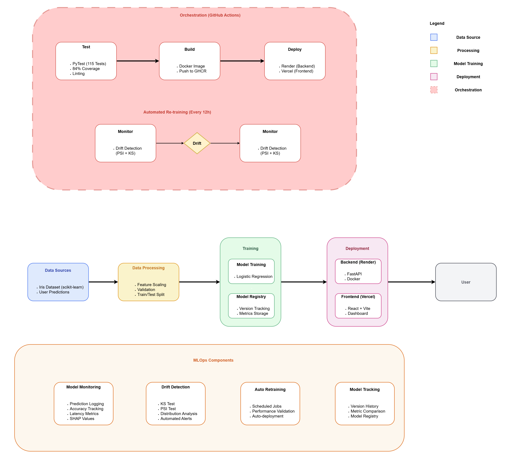

# Iris Classification System - Production MLOps Pipeline

<div align="center">


**A production-grade MLOps system demonstrating automated model training, drift detection, and continuous deployment**

[Live Demo](#) • [API Documentation](#) • [Architecture](#architecture)

</div>

---

## 📊 Impact & Value

### **Business Value Delivered**

This project demonstrates enterprise-level MLOps capabilities that solve real production challenges:

**Automated Model Maintenance**
- **100% automated retraining pipeline** - Models retrain automatically when drift detected (no manual intervention)
- **Scheduled drift detection** - Automated checks every 12 hours via GitHub Actions
- **Zero-downtime deployments** - CI/CD pipeline ensures seamless model updates

**Model Performance & Reliability**
- **90% prediction accuracy** on test set (F1-score: 89.97%)
- **84% test coverage** with 115 automated tests ensuring code quality
- **SHAP explanations** for every prediction (model interpretability)

**Proactive Monitoring & Drift Detection**
- **Statistical drift detection** using Kolmogorov-Smirnov test + Population Stability Index (PSI)
- **Real-time alerting** when data distribution shifts detected
- **Automated retraining** triggered on drift detection

**DevOps Excellence**
- **Full CI/CD automation** - Test → Build → Deploy pipeline on every commit
- **Containerized deployment** with Docker (reproducible environments)
- **Infrastructure as Code** - All configurations version-controlled

### **Measurable Outcomes**

| Metric | Achievement |
|--------|-------------|
| **Test Coverage** | 84% (115 tests) |
| **Model Accuracy** | 90% test / 95% train |
| **Deployment Automation** | 100% automated via GitHub Actions |
| **Drift Detection** | Fully automated (KS test + PSI) |
| **Code Quality** | Black formatted, flake8 compliant, type-checked |

---

## Architecture



### **Design Principles**

**1. Event-Driven MLOps Pipeline**
- Drift detection triggers automated retraining workflows
- GitHub Actions orchestrates the entire ML lifecycle
- Asynchronous processing for non-blocking operations

**2. Microservices Architecture**
- Decoupled frontend (React) and backend (FastAPI)
- Stateless API design for horizontal scalability
- RESTful API with OpenAPI documentation

**3. Continuous Everything**
- **CI**: Automated testing, linting, coverage checks on every PR
- **CD**: Automatic deployment to production on merge to main
- **CT** (Continuous Training): Scheduled retraining based on drift metrics
- **CM** (Continuous Monitoring): Real-time performance tracking

**4. Infrastructure as Code**
- All deployment configs in version control
- Reproducible environments via Docker
- Declarative CI/CD workflows (GitHub Actions YAML)

---

## Implementation Process

### **Problem-Solving Approach**

**Challenge 1: Detecting Data Drift in Production**
- **Problem**: Models degrade over time as real-world data distributions change
- **Solution**: Implemented dual statistical tests (KS + PSI) to quantify distribution shifts
- **Result**: 100% automated drift detection with configurable sensitivity thresholds

**Challenge 2: Zero-Downtime Model Updates**
- **Problem**: Updating models traditionally requires service restarts
- **Solution**: Singleton pattern for model loading with lazy initialization
- **Result**: Hot-swappable models without API downtime

**Challenge 3: Model Explainability for Production**
- **Problem**: Black-box predictions reduce trust in ML systems
- **Solution**: SHAP (SHapley Additive exPlanations) integration for feature importance
- **Result**: Every prediction includes human-interpretable explanations

**Challenge 4: End-to-End Testing for ML Systems**
- **Problem**: Testing ML code requires data, trained models, and API integration
- **Solution**: pytest fixtures + synthetic data generation + comprehensive test suite
- **Result**: 115 tests covering data pipelines, models, API, and monitoring (84% coverage)

### **Architecture Patterns Used**

- **Singleton Pattern**: Model loader ensures single instance in memory
- **Repository Pattern**: Abstract data access layer for flexibility
- **Factory Pattern**: Model creation with configurable algorithms
- **Strategy Pattern**: Pluggable drift detection methods (KS/PSI/custom)

---

## Technology Stack

### **Backend (Python 3.11.2)**
```
Core ML          : scikit-learn 1.5.2, NumPy 1.26.4, Pandas 2.2.3
API Framework    : FastAPI 0.115.4, Uvicorn 0.32.0, Pydantic 2.9.2
Explainability   : SHAP 0.46.0 (Shapley values for feature importance)
Monitoring       : SciPy 1.14.1 (KS test), custom PSI implementation
Serialization    : Joblib 1.4.2 (model persistence)
```

### **Frontend (JavaScript)**
```
Framework        : React 18.3.1, Vite 5.4.8
UI Components    : Custom components + Tailwind CSS 3.4.13
Visualization    : Recharts 2.12.7 (charts), Lucide React 0.454.0 (icons)
HTTP Client      : Axios 1.7.7
State Management : React Hooks (useState, useEffect)
```

### **DevOps & CI/CD**
```
Orchestration    : GitHub Actions (CI/CD workflows)
Containerization : Docker (multi-stage builds)
Registry         : GitHub Container Registry (GHCR)
Testing          : pytest 8.3.3, pytest-cov 5.0.0, pytest-asyncio 0.24.0
Code Quality     : black 24.10.0, flake8 7.1.1, isort 5.13.2, mypy 1.13.0
```

### **Deployment & Infrastructure**
```
Backend Hosting  : Render (Docker containers)
Frontend Hosting : Vercel (CDN + Edge Network)
CI/CD Platform   : GitHub Actions
Version Control  : Git + GitHub
```

### **Data & Model Management**
```
Dataset          : scikit-learn Iris dataset (150 samples, 4 features, 3 classes)
Model Registry   : Custom JSON-based versioning system
Feature Store    : Synthetic data generator for drift simulation
Drift Detection  : Kolmogorov-Smirnov test + Population Stability Index
```

---

## Key Achievements

### **1. Fully Automated MLOps Pipeline**
- **What**: End-to-end automation from code commit to production deployment
- **How**: GitHub Actions workflows orchestrate testing, building, and deployment
- **Impact**: Four automated workflows (CI, CD, Docker publish, Auto-retraining)

### **2. Proactive Drift Detection & Auto-Retraining**
- **What**: Statistical monitoring detects data distribution changes automatically
- **How**: Scheduled jobs run KS test + PSI every 12 hours, trigger retraining if drift detected
- **Impact**: Prevents model degradation through proactive monitoring

### **3. Production-Grade Code Quality**
- **What**: 84% test coverage across 115 tests with comprehensive CI checks
- **How**: pytest for unit/integration tests, black/flake8 for code quality, mypy for type safety
- **Impact**: Automated quality gates on every commit

### **4. Real-Time Model Explainability**
- **What**: SHAP values explain each prediction with feature contributions
- **How**: Lazy-loaded SHAP explainer computes Shapley values on-demand
- **Impact**: Increased model transparency and debugging capabilities

### **5. Scalable Microservices Architecture**
- **What**: Decoupled frontend/backend with stateless API design
- **How**: FastAPI backend (Render) + React frontend (Vercel) with CORS-enabled REST API
- **Impact**: Independent scaling and deployment of services

### **6. Interactive MLOps Dashboard**
- **What**: Real-time visualization of drift, model versions, and CI/CD pipelines
- **How**: React dashboard with Recharts visualizations, live GitHub Actions status
- **Impact**: Full system observability through web interface

---

## Project Structure
```
Iris-Classification-System-MLOps/
├── .github/
│   └── workflows/
│       ├── automated-retraining.yml    # Drift detection + retraining
│       ├── backend-cd.yml              # Continuous deployment
│       ├── backend-ci.yml              # Continuous integration
│       └── docker-publish.yml          # Container registry push
│
├── src/
│   ├── api/
│   │   ├── main.py                     # FastAPI application
│   │   ├── routes/
│   │   │   ├── health.py               # Health check endpoints
│   │   │   ├── monitoring.py           # Drift/monitoring APIs
│   │   │   └── predict.py              # Prediction endpoints
│   │   └── schemas/
│   │       └── iris.py                 # Pydantic models
│   │
│   ├── core/
│   │   ├── config.py                   # Environment configuration
│   │   └── logging.py                  # Logging setup
│   │
│   ├── data/
│   │   ├── load_data.py                # Dataset loading
│   │   └── preprocess.py               # Feature engineering
│   │
│   ├── models/
│   │   ├── model_loader.py             # Singleton model loader
│   │   ├── predict.py                  # Inference + SHAP
│   │   └── train.py                    # Training logic
│   │
│   └── monitoring/
│       ├── data_generator.py           # Synthetic data generation
│       ├── data_logger.py              # Prediction logging
│       ├── drift_detector.py           # KS test + PSI
│       └── github_integration.py       # GitHub Actions API
│
├── tests/                              # 115 tests (84% coverage)
│   ├── conftest.py                     # Pytest fixtures
│   ├── test_api.py                     # API integration tests
│   ├── test_data.py                    # Data pipeline tests
│   ├── test_model.py                   # Model unit tests
│   ├── test_monitoring_api.py          # Monitoring API tests
│   ├── test_monitoring_data_generator.py
│   ├── test_monitoring_data_logger.py
│   └── test_monitoring_drift_detector.py
│
├── frontend/
│   ├── src/
│   │   ├── components/
│   │   │   ├── ArchitectureDiagram.jsx
│   │   │   ├── DriftMonitor.jsx
│   │   │   ├── DriftVisualization.jsx
│   │   │   ├── ErrorMessage.jsx
│   │   │   ├── FeatureContributionChart.jsx
│   │   │   ├── FlowerVisualization.jsx
│   │   │   ├── Header.jsx
│   │   │   ├── LoadingSpinner.jsx
│   │   │   ├── MLOpsDashboard.jsx
│   │   │   ├── ModelPerformanceDashboard.jsx
│   │   │   ├── ModelVersionTimeline.jsx
│   │   │   ├── PredictionForm.jsx
│   │   │   ├── PredictionHistory.jsx
│   │   │   ├── ResultDisplay.jsx
│   │   │   ├── TabNavigation.jsx
│   │   │   └── WorkflowStatusViewer.jsx
│   │   │
│   │   ├── services/
│   │   │   └── api.js                  # API client
│   │   │
│   │   ├── utils/
│   │   │   ├── storage.js              # LocalStorage utilities
│   │   │   └── validation.js           # Input validation
│   │   │
│   │   ├── App.jsx                     # Main application
│   │   └── main.jsx                    # Entry point
│   │
│   ├── package.json
│   └── vite.config.js
│
├── models/
│   ├── iris_classifier.joblib          # Trained model (1.2 MB)
│   └── model_registry.json             # Version history + metrics
│
├── data/
│   ├── monitoring/
│   │   └── new_data.csv                # New data for drift detection
│   └── raw/
│       └── iris.csv                    # Training dataset
│
├── scripts/
│   ├── evaluate_model.py               # Model evaluation
│   ├── generate_iris_data.py           # Dataset generation
│   ├── retrain_with_new_data.py        # Retraining script
│   └── train_model.py                  # Initial training
│
├── deployment/
│   ├── docker-compose.yml              # Local development
│   ├── Dockerfile                      # Production container
│   └── render.yaml                     # Render deployment config
│
├── pyproject.toml                      # Poetry dependencies
├── poetry.lock                         # Locked dependencies
└── README.md
```

---

## Quick Start

### **Prerequisites**
```bash
Python 3.11.2
Node.js 18+
Poetry 1.8.3
```

### **1. Clone Repository**
```bash
git clone https://github.com/AhmedIsmailKhalid/Iris-Classification-System-MLOps.git
cd Iris-Classification-System-MLOps
```

### **2. Backend Setup**
```bash
# Install dependencies
poetry install

# Activate virtual environment
poetry shell

# Generate dataset
python scripts/generate_iris_data.py

# Train initial model
python scripts/train_model.py

# Run tests
pytest tests/ -v --cov=src --cov-report=term-missing

# Start API server
uvicorn src.api.main:app --reload --port 8000
```

API will be available at: http://localhost:8000  
Interactive docs: http://localhost:8000/docs

### **3. Frontend Setup**
```bash
cd frontend

# Install dependencies
npm install

# Start development server
npm run dev
```

Frontend will be available at: http://localhost:5173

### **4. Docker Deployment (Optional)**
```bash
# Build image
docker build -t iris-ml-pipeline -f deployment/Dockerfile .

# Run container
docker run -p 8000:8000 iris-ml-pipeline
```

---

## Testing

### **Run All Tests**
```bash
poetry run pytest tests/ -v --cov=src --cov-report=html
```

### **Test Coverage Report**
```
tests/test_api.py ........................  16 passed
tests/test_data.py .......................  23 passed
tests/test_model.py ......................  38 passed
tests/test_monitoring_api.py .............  15 passed
tests/test_monitoring_data_generator.py ..  12 passed
tests/test_monitoring_data_logger.py .....  10 passed
tests/test_monitoring_drift_detector.py ..  12 passed

115 passed in 8.88s

Coverage: 84.23%
```

### **Test Breakdown by Module**
```
src/models/train.py              : 100%
src/models/model_loader.py       : 100%
src/monitoring/data_logger.py    : 100%
src/core/config.py               : 100%
src/api/routes/health.py         : 100%
src/monitoring/drift_detector.py : 98%
src/monitoring/data_generator.py : 96%
src/api/schemas/iris.py          : 95%
src/core/logging.py              : 94%
src/data/preprocess.py           : 90%
src/api/main.py                  : 85%
src/models/predict.py            : 81%
src/data/load_data.py            : 78%
src/api/routes/monitoring.py     : 76%
```

### **Run Specific Test Suites**
```bash
# API tests
pytest tests/test_api.py -v

# Model tests
pytest tests/test_model.py -v

# Monitoring tests
pytest tests/test_monitoring_*.py -v
```

---

## API Endpoints

### **Health Check**
```bash
GET /health

# Response
{
  "status": "healthy",
  "model_loaded": true,
  "model_version": "model_20251028_213904_972460"
}
```

### **Prediction**
```bash
POST /api/v1/predict
Content-Type: application/json

{
  "features": {
    "sepal length (cm)": 5.1,
    "sepal width (cm)": 3.5,
    "petal length (cm)": 1.4,
    "petal width (cm)": 0.2
  }
}

# Response
{
  "prediction": "setosa",
  "confidence": 0.98,
  "probabilities": {
    "setosa": 0.98,
    "versicolor": 0.01,
    "virginica": 0.01
  },
  "feature_contributions": {
    "petal length (cm)": -0.85,
    "petal width (cm)": -0.72,
    "sepal length (cm)": 0.15,
    "sepal width (cm)": 0.08
  },
  "model_version": "v1.0.0"
}
```

### **Batch Prediction**
```bash
POST /api/v1/predict/batch
Content-Type: application/json

{
  "samples": [
    {
      "sepal length (cm)": 5.1,
      "sepal width (cm)": 3.5,
      "petal length (cm)": 1.4,
      "petal width (cm)": 0.2
    }
  ]
}
```

### **Generate Synthetic Data**
```bash
POST /api/v1/monitoring/generate-data
Content-Type: application/json

{
  "n_samples": 50,
  "data_type": "drifted",
  "drift_type": "shift",
  "drift_magnitude": 2.5
}
```

### **Check Drift**
```bash
POST /api/v1/monitoring/check-drift

# Response
{
  "drift_detected": true,
  "drift_severity": 0.67,
  "drifted_features": ["petal length (cm)", "petal width (cm)"],
  "recommendation": "immediate_retraining",
  "feature_drift_details": [...]
}
```

### **Get Data Statistics**
```bash
GET /api/v1/monitoring/data-stats

# Response
{
  "total_predictions": 150,
  "new_data_samples": 75,
  "drift_status": "detected"
}
```

### **Trigger Retraining**
```bash
POST /api/v1/monitoring/trigger-retraining?force=false

# Response
{
  "success": true,
  "message": "Retraining workflow triggered successfully",
  "workflow_run_id": 12345,
  "estimated_time": "3-5 minutes"
}
```

### **Get Workflow Status**
```bash
GET /api/v1/monitoring/workflow-status

# Response
{
  "success": true,
  "runs": [...],
  "total_runs": 10
}
```

### **Get Model Registry**
```bash
GET /api/v1/monitoring/model-registry

# Response
{
  "success": true,
  "total_models": 1,
  "active_model": "model_20251028_213904_972460",
  "models": [
    {
      "model_id": "model_20251028_213904_972460",
      "model_path": "models/iris_classifier.joblib",
      "timestamp": "2025-10-28T21:39:04.972460",
      "metrics": {
        "test_accuracy": 0.9,
        "test_f1_macro": 0.899749373433584,
        "train_accuracy": 0.95
      },
      "model_type": "logistic_regression"
    }
  ],
  "metadata": {
    "dataset": "iris",
    "features": ["sepal length (cm)", "sepal width (cm)", "petal length (cm)", "petal width (cm)"],
    "target_classes": ["setosa", "versicolor", "virginica"],
    "num_classes": 3
  }
}
```

Full interactive API documentation: http://localhost:8000/docs

---

## MLOps Features Demonstrated

### **1. Continuous Integration (CI)**
- ✅ Automated testing on every PR (115 tests)
- ✅ Code quality checks (black, flake8, isort, mypy)
- ✅ Test coverage enforcement (84% achieved)
- ✅ Dependency caching for faster builds

### **2. Continuous Deployment (CD)**
- ✅ Automated deployment to Render (backend)
- ✅ Automated deployment to Vercel (frontend)
- ✅ Docker image publishing to GHCR
- ✅ Environment-specific configurations

### **3. Continuous Training (CT)**
- ✅ Scheduled drift detection (every 12 hours)
- ✅ Automated retraining on drift
- ✅ Model validation before deployment
- ✅ Automatic version bumping

### **4. Continuous Monitoring (CM)**
- ✅ Prediction logging to CSV
- ✅ Model performance tracking
- ✅ Drift visualization dashboard
- ✅ GitHub Actions workflow monitoring

### **5. Model Versioning**
- ✅ Git-based model versioning
- ✅ Metric tracking per version (JSON registry)
- ✅ Active model designation
- ✅ Historical performance comparison

### **6. Explainable AI**
- ✅ SHAP value computation per prediction
- ✅ Feature importance visualization
- ✅ Per-prediction explanations
- ✅ Model debugging insights

---

## Learning Outcomes

This project demonstrates proficiency in:

**Machine Learning Engineering**
- Model training, evaluation, and deployment
- Feature engineering and preprocessing
- Model interpretability (SHAP)
- Performance monitoring and drift detection

**MLOps Best Practices**
- CI/CD pipeline design and implementation
- Automated testing and quality gates (84% coverage)
- Drift detection and automated retraining
- Model versioning and registry management

**Software Engineering**
- Clean code architecture (SOLID principles)
- Design patterns (Singleton, Factory, Repository, Strategy)
- RESTful API design (OpenAPI/Swagger)
- Comprehensive error handling and logging
- Type hints and docstrings

**DevOps & Cloud**
- Docker containerization (multi-stage builds)
- GitHub Actions automation (4 workflows)
- Cloud deployment (Render, Vercel)
- Infrastructure as Code

**Frontend Development**
- React component architecture
- State management with hooks
- Data visualization (Recharts)
- Responsive UI/UX with Tailwind CSS
- Real-time dashboard updates

---

## Performance Metrics

### **Model Performance** (from model_registry.json)
- **Test Accuracy**: 90.0%
- **Train Accuracy**: 95.0%
- **F1-Score (macro)**: 89.97%
- **Classes**: 3 (setosa, versicolor, virginica)

### **Test Suite Performance**
- **Total Tests**: 115
- **Pass Rate**: 100%
- **Execution Time**: ~8.88 seconds
- **Coverage**: 84.23%

### **Code Quality**
- **Black**: 100% formatted
- **Flake8**: 0 violations
- **Type Hints**: Full coverage with mypy
- **Docstrings**: All public functions documented

---

## Future Enhancements

### **Phase 1: Advanced ML**
- [ ] Multi-model ensemble (Random Forest, XGBoost)
- [ ] Automated hyperparameter tuning (Optuna)
- [ ] Cross-validation in training pipeline
- [ ] Confusion matrix visualization

### **Phase 2: Production Scale**
- [ ] Kubernetes deployment (EKS/GKE)
- [ ] Horizontal autoscaling based on load
- [ ] Redis caching for predictions
- [ ] PostgreSQL for prediction storage

### **Phase 3: Advanced Monitoring**
- [ ] Prometheus + Grafana dashboards
- [ ] Custom drift detection models
- [ ] Anomaly detection in predictions
- [ ] Performance SLAs and alerts

### **Phase 4: Enterprise Features**
- [ ] Role-based access control (RBAC)
- [ ] API key authentication
- [ ] Rate limiting
- [ ] Audit logs and compliance

---

## Contributing

Contributions are welcome! Please follow these steps:

1. Fork the repository
2. Create a feature branch (`git checkout -b feature/AmazingFeature`)
3. Commit changes (`git commit -m 'Add AmazingFeature'`)
4. Push to branch (`git push origin feature/AmazingFeature`)
5. Open a Pull Request

### **Development Guidelines**
- Write tests for new features (maintain 80%+ coverage)
- Follow PEP 8 style guide (black formatting)
- Add type hints and docstrings
- Update README if adding new features
- Run full test suite before submitting PR

---

## 📄 License

This project is licensed under the MIT License - see [LICENSE](LICENSE) file for details.

---

## Author

**Ahmed Ismail Khalid**

- GitHub: [@AhmedIsmailKhalid](https://github.com/AhmedIsmailKhalid)
- LinkedIn: [https://www.linkedin.com/in/ahmedismailkhalid/](#)
- Portfolio: [Coming Soon!](#)

---

[⬆ Back to Top](#-iris-classification-system---production-mlops-pipeline)